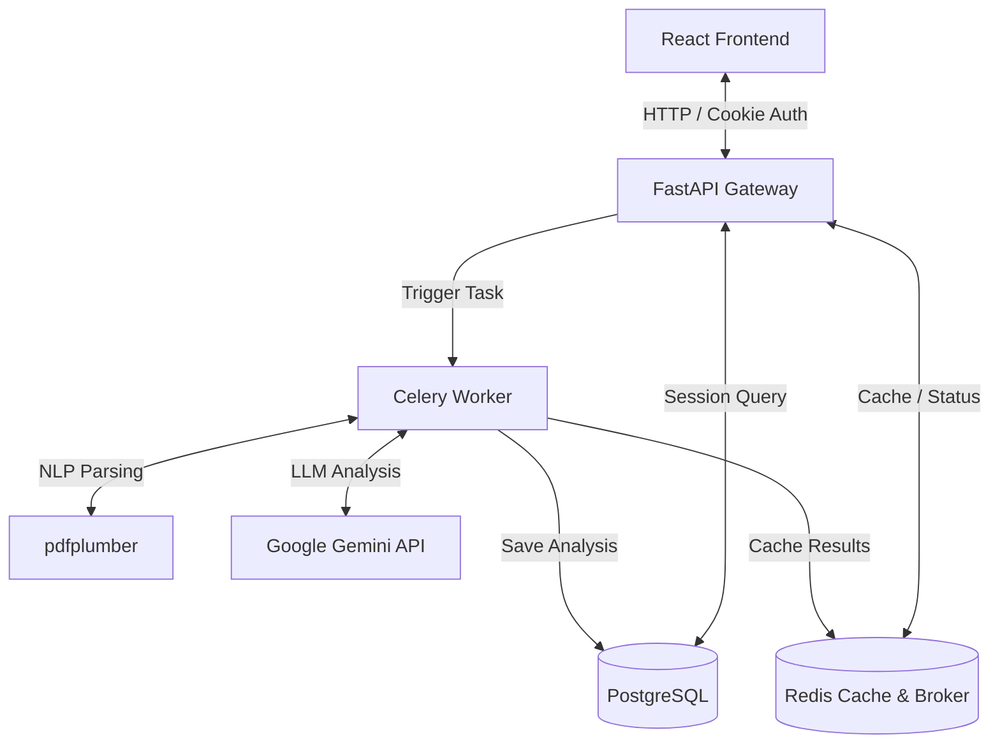

# AI Resume Analyzer - SaaS Platform

A production-grade, microservice-architected **AI Resume Analyzer & Career Intelligence Platform** built with **FastAPI**, **React**, **PostgreSQL**, **Redis**, **Celery**, and the **Google Gemini API**.

---

## 🏗️ System Architecture

The platform uses a decoupled, event-driven architecture designed to scale under load. Heavy PDF parsing and LLM operations are offloaded to distributed background workers, maintaining an active, sub-second API gateway responsiveness.



---

## 🛠️ Technology Stack

### Core Frontend
* **UI Engine**: React 19 (Vite)
* **Animation & Motion**: Framer Motion
* **Styling**: TailwindCSS & custom Vanilla CSS layer (Glassmorphic Token System)
* **Charts**: Recharts
* **State & Routing**: React Router v6 & Context API

### Core Backend & Database
* **Gateway**: FastAPI
* **Background Processing**: Celery & Redis
* **Database**: PostgreSQL (SQLAlchemy ORM)
* **Schema Migrations**: Alembic
* **Authentication**: JWT tokens stored in HttpOnly cookies
* **AI Model**: Google Gemini Pro (NLP matching engine)

---

## 📦 Production Docker Setup

The system is fully containerized for cloud deployment. Docker configurations have been hardened with healthchecks, restart policies, and run under non-root system users.

### Environment Configuration
Create a `.env` file in the root directory:

```env
# Database Credentials
POSTGRES_USER=postgres
POSTGRES_PASSWORD=your_secure_password
POSTGRES_DB=resume_analyzer
DATABASE_URL=postgresql://postgres:your_secure_password@db:5432/resume_analyzer

# Redis Broker
REDIS_URL=redis://redis:6379/0

# Gemini API Key
GEMINI_API_KEY=your_gemini_api_key_here

# Security Settings
SECRET_KEY=your_jwt_secret_signing_key_here
ACCESS_TOKEN_EXPIRE_MINUTES=1440
RATE_LIMIT_PER_MINUTE=60
```

### Launching the Stack

```bash
# Build and run the entire microservices stack
docker compose up --build -d

# Verify all services are healthy
docker compose ps
```

---

## 🚀 Local Developer Installation

### Backend Setup

1. Navigate to the backend directory and create a virtual environment:
   ```bash
   cd backend
   python -m venv venv
   source venv/bin/activate  # On Windows: venv\Scripts\activate
   ```
2. Install Python dependencies:
   ```bash
   pip install -r requirements.txt
   ```
3. Run migrations and start the local API dev server:
   ```bash
   python prestart.py
   uvicorn main:app --reload --port 8000
   ```

### Frontend Setup

1. Navigate to the frontend directory:
   ```bash
   cd ../frontend
   ```
2. Install Node dependencies:
   ```bash
   npm install
   ```
3. Run the development server:
   ```bash
   npm run dev
   ```

---

## 📸 Screenshots Placeholders

* **Interactive Candidate Timeline**: Real-time progress tracking from extraction to matching.
* **Skill Radar**: Interactive Recharts radar displaying matched vs missing competencies.
* **Recruiter Dashboard**: Analytics chart dashboards outlining applicant distribution and system health.

---

## 🗺️ Product Roadmap

- [ ] **Multi-Tenant Workspaces**: Organization billing and team accounts.
- [ ] **Collaborative Recruiter Notes**: Multi-user feedback and rating streams on profiles.
- [ ] **Automated PDF Parsing Pipelines**: Direct email ingestion hooks.
